#### CICLO FORMATIVO DE GRADO SUPERIOR

### DESARROLLO DE APLICACIONES MULTIPLATAFORMA

##### ACCESO A DATOS - 2º CURSO

# [TO DO LIST]

###### Curso: 2021/22

###### AUTOR: [FELIX VALOR ESCRIBANO]

------

# Introducción

## Motivación y objetivos

Me gustaría hacer esta aplicación ya que cuando he querido utilizar una aplicación de tareas ninguna me ofrecia todas las funcionalidades que yo quería tener en una, por lo que me gustaría juntar las ideas que tienen algunas aplicaciones de este estilo y juntarlas todas en una sola aplicación

## Descripción de la aplicación

Este cms tendrá la función de administrar la aplicación Android de manera que se encargara de almacenar todos los usuarios y tareas de estos, y mediante el API REST enviar o recibir la información necesaria cuando una aplicación lo necesite.

# Especificación de requisitos

## Requisitos funcionales CMS

El administrador deberá poder hacer lo siguiente:

**Control de acceso:** Al acceder la primera vez deberá pedirnos que iniciemos sesión, en un principio el único que podrá acceder es el administrador

**Gestionar usuarios:**  El administrador tiene que ser capaz de poder realizar la creación, modificación y eliminación de usuarios. 

**Sincronización de la BDD con la aplicación:** El administrador deberá poder sincronizar la base de datos alojada en el servidor con la base de datos local que tenga la aplicación.

## Wireframe

## API REST

Como se puede ver en el diagrama de clases tenemos una clase llamada ApiRestController, esta será la encargada de recibir y enviar la información a nuestra aplicación Android:

## Requisitos no funcionales

Para poder utilizar el cms, como requisitos no funcionales son los siguientes:

- Conexión estable a internet
- Sistema operativo: Windows 8.1 en adelante, Linux o MacOS
- Navegador web: Google Chrome, Microsoft Edge, Mozilla, Opera GX, etc... (Cualquier navegador moderno sirve)

# Análisis Funcional

## Interfaz gráfico

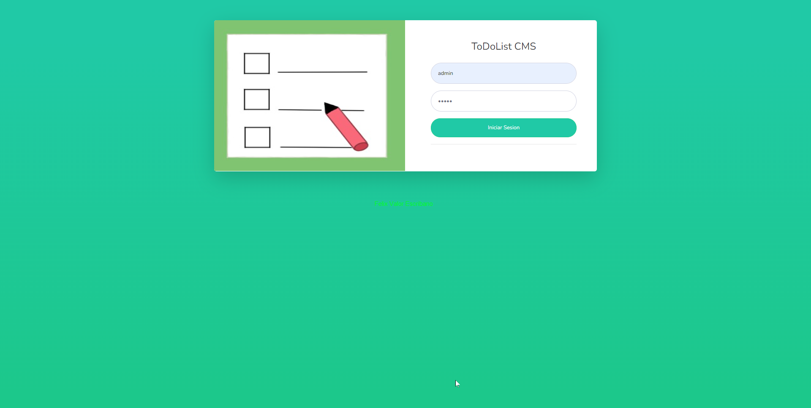

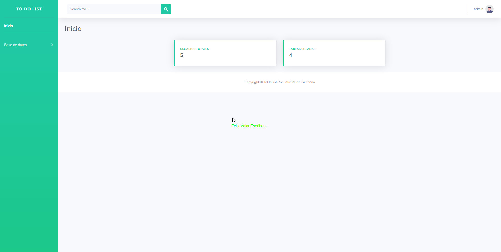

Al igual que esta diseñada la ventana de usuarios es igual la de tareas

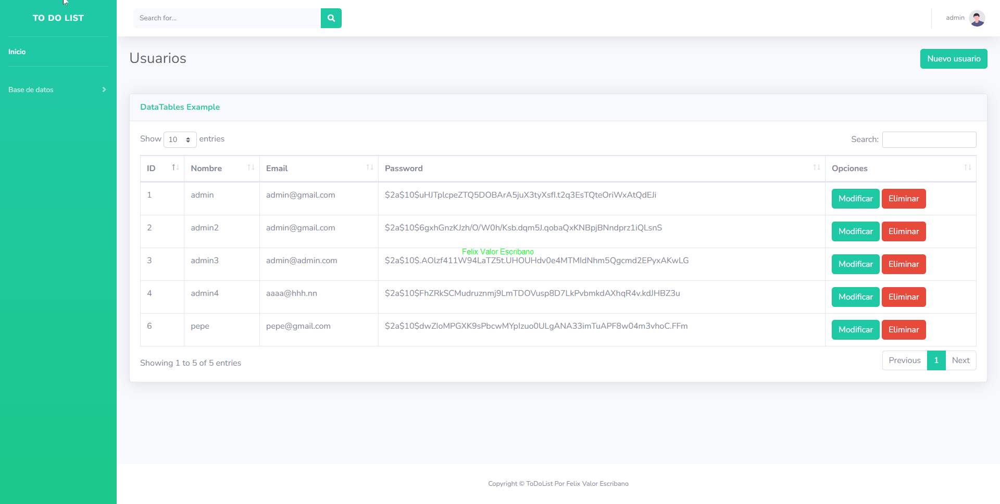

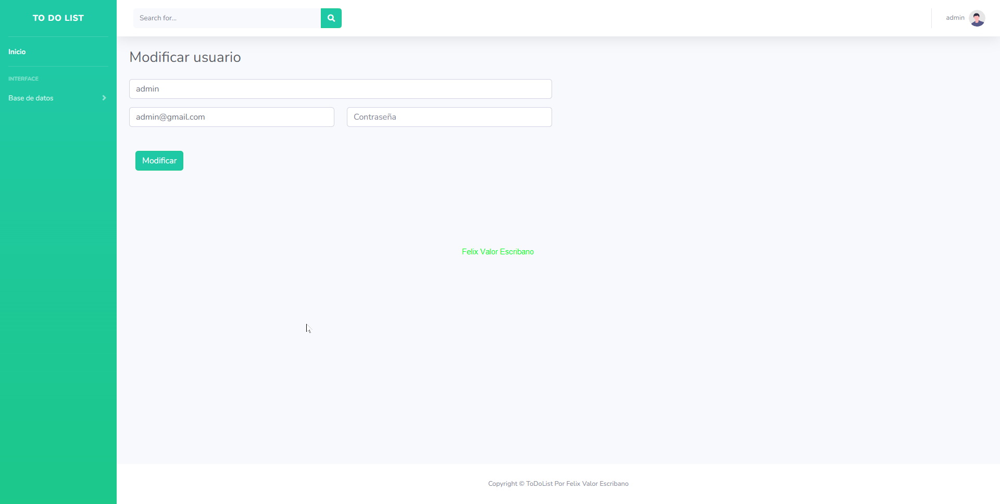

## Diagrama de clases

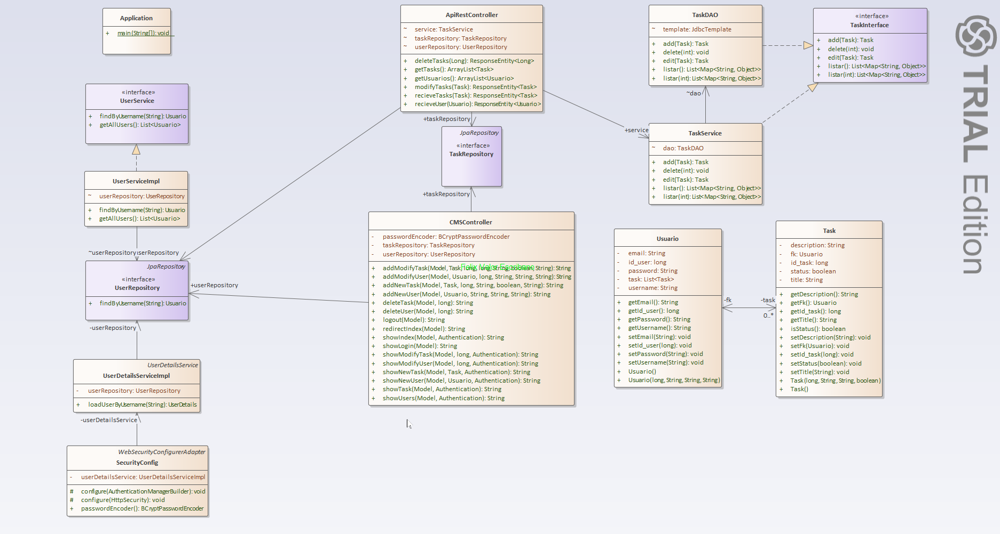

## Diagrama E/R

**Users:** En esta tabla almacenaremos toda la información relacionada con los usuarios

**Task:** En esta tabla se almacenaran las tareas de los usuarios pudiendo identificar y separar los de cada usuario gracias al user_id

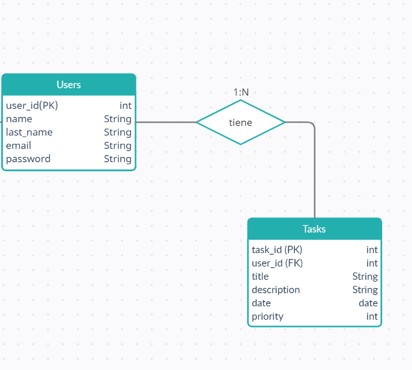

## Plan de pruebas

Una vez acceda el administrador tras pasar el control de acceso, deberá ver una pantalla inicial en la que se podrán visualizar distintas graficas con estadísticas de la aplicación. Arriba a la derecha tendrá un icono con el nombre del usuario en el que si le da clic le aparecerá la opción de cerrar sesión. En la parte de la izquierda tendremos una barra en la que podremos acceder a las tablas de la base de datos y, por ejemplo, en la tabla usuarios, ver todos los usuarios que hay registrados actualmente, podremos modificarlos, eliminarlos con los botones que hay en la propia tabla y añadir nuevos dándole al botón que hay justo encima de esta tabla.

# Diseño Técnico

## Diagrama de paquetes

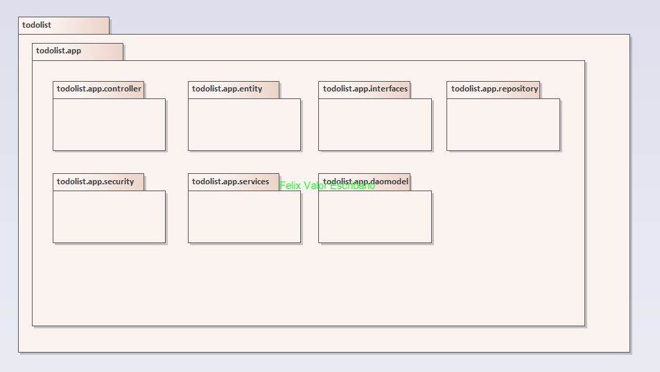

## Arquitectura del sistema

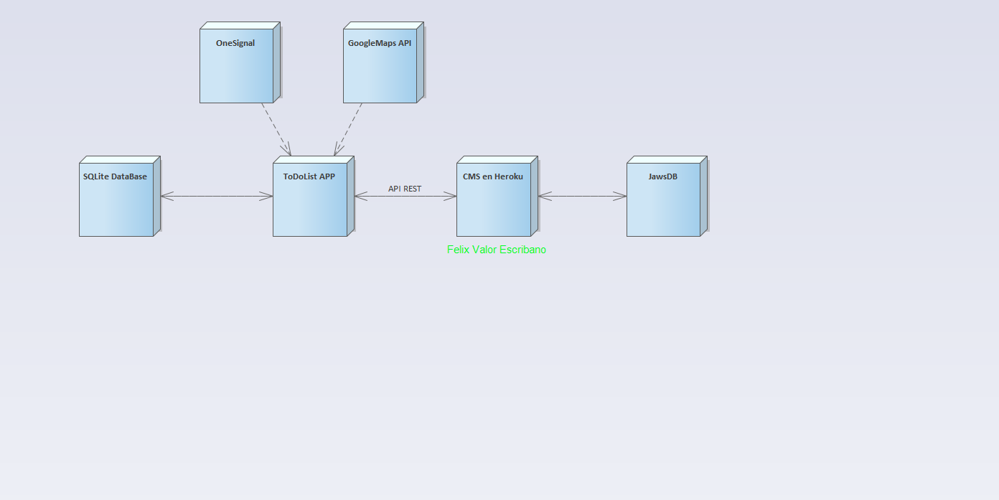

## Entorno de desarrollo, librerías y servicios

En este punto se explicarán las diferentes tecnologías utilizadas para la realización del proyecto, así como los elementos más importantes que permitan entender el funcionamiento del sistema.

## Instrucciones para la compilación, ejecución y despliegue de la aplicación

Describe los pasos a seguir para poder compilar el proyecto y ejecutarlo.

Las credenciales necesarias para entrar en el cms son tanto usuario como contraseña admin. Si queremos probar el cms de manera local nos aseguraremos de tener una base de datos creada con el nombre "todolist" y por lo demás no debería haber problemas para ejecutar el cms desde otro ordenador. A continuación adjunto una captura del fichero "application.properties"

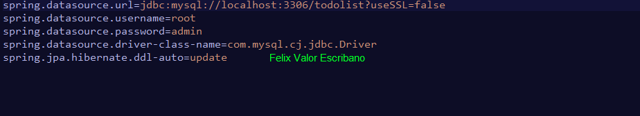

Despliegue del cms en Heroku:

Simplemente tendremos que seguir las instrucciones que nos indican en la siguiente captura:

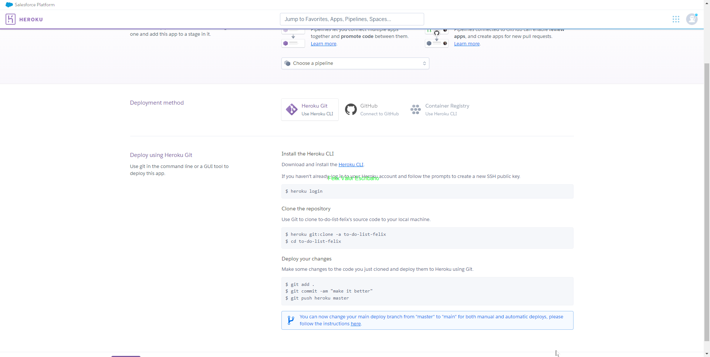

Después configuraremos un add-on para poder tener una base de datos:

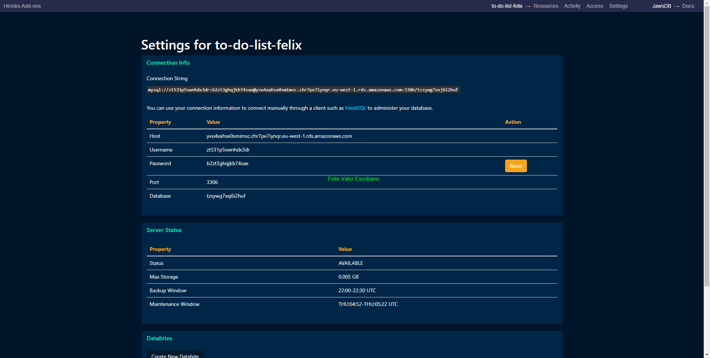

Por ultimo podemos ver a continuación las acciones que se han llevado a cabo hasta ahora en heroku y si le damos a "open app", nos llevara al login del cms:

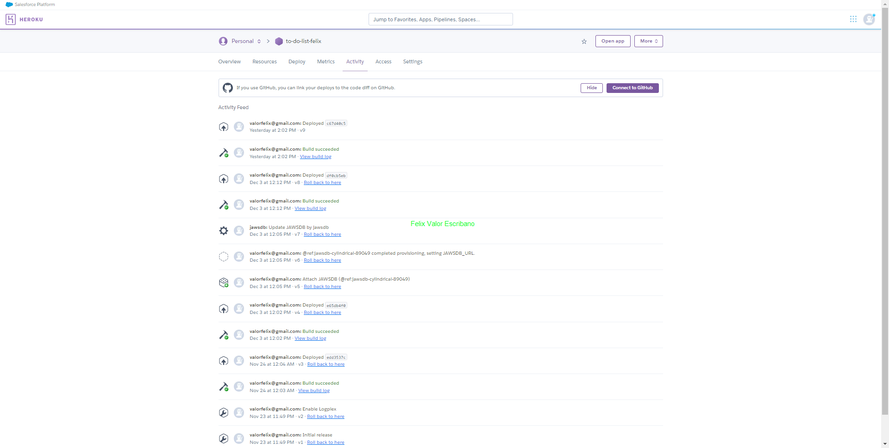

# Informe de pruebas

En el siguiente video muestro como he probado la funcionalidad del CMS

https://youtu.be/gspOPlLWY-g

# Conclusiones

## Conocimientos adquiridos

Este trabajo me ha servido para asentar conocimientos sobre Springboot, además he aprendido a hacer API REST y he aprendido a como subir un proyecto a Heroku

## Mejoras futuras

Incluiría los tokens para el API REST y gráficos en la pantalla principal.